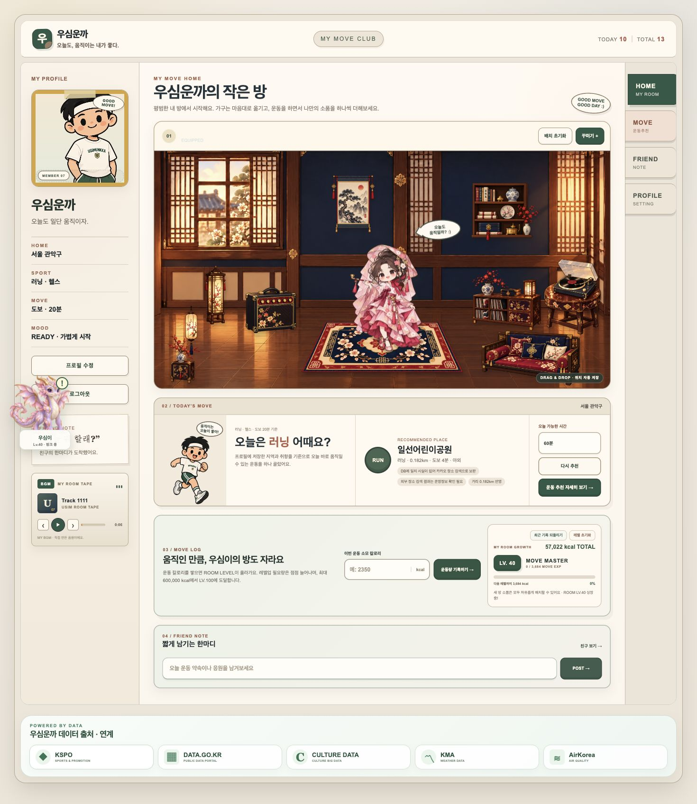
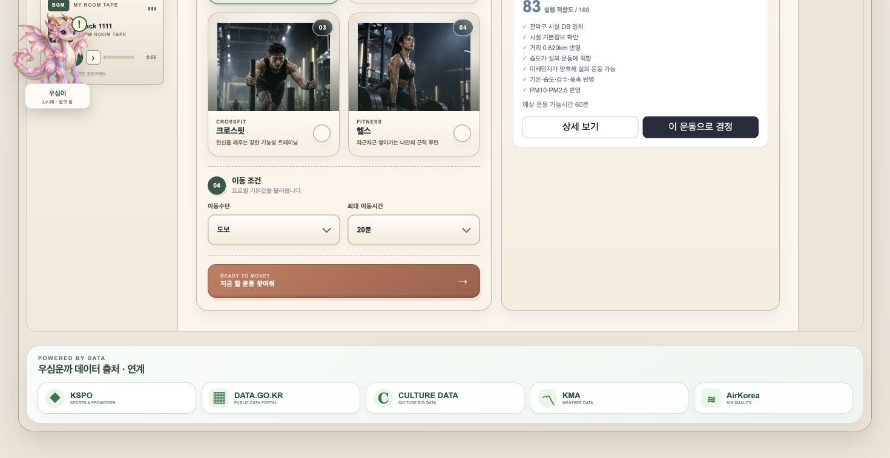
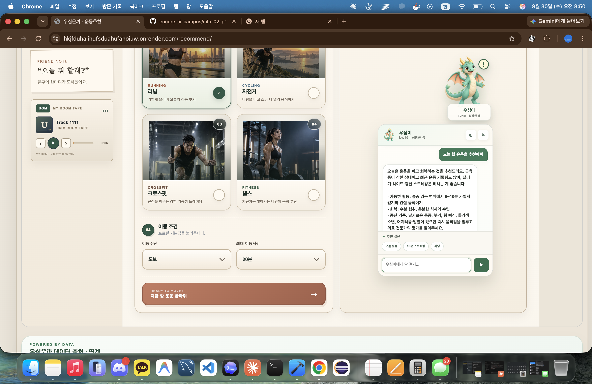
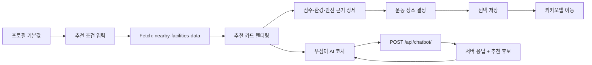
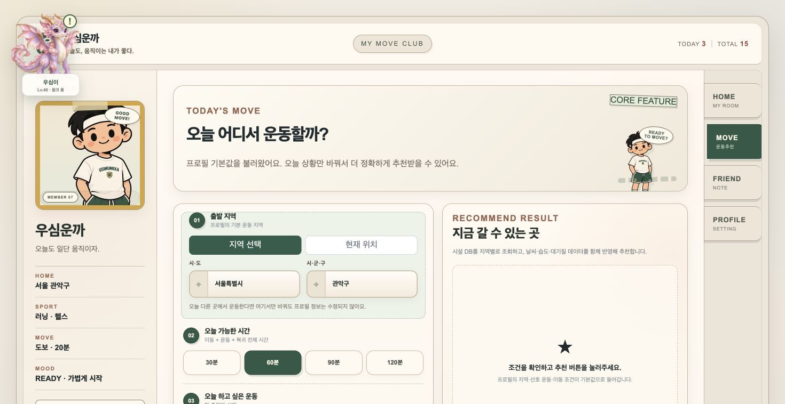

# 우심운까 | Frontend Contribution Portfolio

> **공공데이터 기반 생활체육 추천 서비스의 사용자 경험을 화면과 인터랙션으로 연결한 4인 팀 프로젝트 기여 포트폴리오**

**Personal contribution portfolio by 신경호 (Shinkyeongho)**  
Team project: [encore-ai-campus/mlo-02-p1-team3](https://github.com/encore-ai-campus/mlo-02-p1-team3)

> This repository is a personal contribution portfolio derived from a team project.  
> 팀 프로젝트 전체를 개인 프로젝트처럼 재포장하지 않고, **제가 맡은 Frontend · UI/UX · 발표자료 영역과 실제 최종 구현에서 확인 가능한 기여 지점**을 중심으로 정리했습니다.

---

## 1. Project at a glance

**우심운까(우리 심심한데 운동이나 할까?)** 는 사용자의 지역·운동 선호·이동 조건과 체육시설, 날씨, 대기질, 운영정보를 결합해 **“지금 실제로 가기 좋은 운동 장소”** 를 추천하고, 운동 기록을 레벨·캐릭터·방 꾸미기와 연결해 지속적인 운동을 돕는 웹서비스입니다.

| 핵심 기능 | 설명 |
|---|---|
| 운동 장소 추천 | 지역/현재 위치, 종목, 가용시간, 이동 조건을 입력해 후보 조회 |
| 추천 근거 제공 | 점수, 거리, 날씨, 대기질, 운영정보를 카드와 상세 화면에서 설명 |
| 운동 기록/보상 | 칼로리 기록 → 레벨업 → 방/캐릭터 보상 |
| 친구 기능 | 친구 코드 조회, 요청·수락, 친구 운동방 방문, 한마디 |
| AI 운동 코치 `우심이` | Django 서버를 통해 질문·추천 context를 전달받아 대화형 운동 도움 제공 |

### 주요 화면

| HOME | 추천 결과 |
|---|---|
|  |  |

| 추천 상세 | AI 운동 코치 |
|---|---|
|  |  |

---

## 2. Team & My Role

프로젝트는 **4인 팀 프로젝트**로 진행했습니다.

| 영역 | 담당 |
|---|---|
| Frontend · 발표자료 | **신경호**, 류지예 |
| 서비스 기획 · 데이터 엔지니어링 | 백선영 |
| Backend · 프로젝트 전반 | 김형준 |

### My Role — 신경호

최종 팀 README에 기록된 제 역할은 **Frontend · 발표자료**이며, 담당 업무는 **서비스 화면 구현, 사용자 인터페이스 구성, 발표자료 준비**입니다.

제가 이 포트폴리오에서 집중적으로 설명하는 기여 영역은 다음과 같습니다.

1. **서비스 화면과 공통 UI shell 구성/고도화**
2. **추천 조건 입력 → 결과 카드 → 상세 근거 → 장소 결정 흐름의 Frontend 연동**
3. **AI 운동 코치 `우심이`의 NPC형 UI, 메시지/추천 카드 인터랙션, Django API 연동 UI**
4. **캐릭터·미니룸 기반 인터랙션과 서비스 톤앤매너 유지**
5. **공공데이터 출처를 사용자가 인지할 수 있는 UI 구성**
6. **프로젝트 결과를 발표자료와 시연 화면으로 구조화**

> **Contribution boundary**  
> 추천 점수 계산, 데이터 수집·정제·파이프라인, DB 구축, OpenAI 호출 로직 자체를 제가 단독 구현했다고 주장하지 않습니다. 해당 기능을 **사용자가 이해하고 조작할 수 있는 화면으로 연결한 Frontend 영역**을 중심으로 설명합니다.

자세한 구분은 [`CONTRIBUTIONS.md`](CONTRIBUTIONS.md)에서 확인할 수 있습니다.

---

## 3. Tech Stack I Worked With

| Category | Stack | Portfolio focus |
|---|---|---|
| Frontend | HTML5, CSS3, Vanilla JavaScript | UI 구성, 상태 표현, interaction |
| Server rendering | Django Template | 사용자/세션 context를 화면에 연결 |
| API integration | Fetch API, JSON, CSRF | 추천·친구·기록·챗봇 API와 UI 연결 |
| Location | Geolocation API | 현재 위치 조회 및 오류 UX |
| UI state | DOM, localStorage, server state | 챗봇 위치, 방 배치, 프로필/추천 상태 표현 |
| Collaboration | GitHub, Notion | 협업·문서화·발표 준비 |

팀 전체 기술 스택에는 Django, Supabase(PostgreSQL/PostGIS), 공공데이터 API, BeautifulSoup, OpenAI API 등이 포함됩니다. 이 저장소에서는 **제가 면접에서 책임 있게 설명할 수 있는 Frontend 연결 지점**을 중심으로 다룹니다.

---

## 4. Frontend Flow



더 자세한 구조:
- [`docs/architecture/frontend-flow.md`](docs/architecture/frontend-flow.md)
- [`docs/architecture/recommendation-ui-flow.md`](docs/architecture/recommendation-ui-flow.md)
- [`docs/architecture/ai-coach-flow.md`](docs/architecture/ai-coach-flow.md)

---

## 5. Key Contribution 01 — 추천 결과를 “설명 가능한 화면”으로 만들기

### 문제

추천 서버가 점수만 반환하면 사용자는 **왜 이 시설이 높은 순위인지** 이해하기 어렵습니다. 추천 서비스에서는 결과 자체뿐 아니라 **신뢰할 수 있는 근거 표현**이 중요하다고 판단했습니다.

### Frontend에서 해결한 방식

- 추천 결과를 `실행 적합도 / 100` 점수와 함께 표시
- 서버가 전달한 `reasons`를 카드에 노출
- 운영 공지가 있으면 별도 안내문으로 구분
- 상세 보기에서 **기본/거리/날씨·운동환경/대기질/운영정보 보정**을 분리
- 기온·습도·강수·풍속·PM10·PM2.5를 별도 환경 데이터로 표시
- AED/안전점검 정보가 없으면 “확인 가능한 데이터 없음”으로 표현


### 구현에서 중요하게 본 부분

`recommend.js`는 화면에 서버 값을 넣을 때 `escapeHtml()`을 사용하고, 결과가 없거나 API 호출이 실패했을 때도 **빈 화면이 아니라 원인을 설명하는 상태 UI**를 표시합니다.

또한 시설 선택 시 서버 저장이 끝난 뒤 지도를 열면 브라우저 팝업 차단에 걸릴 수 있어, 클릭 직후 빈 탭을 먼저 열고 저장 성공 후 지도 URL로 전환하는 흐름을 사용했습니다.

관련 코드 리뷰:
- [`snippets/recommendation-ui-excerpt.js`](snippets/recommendation-ui-excerpt.js)
- [`docs/case-studies/01-recommendation-explainability.md`](docs/case-studies/01-recommendation-explainability.md)

---

## 6. Key Contribution 02 — AI 운동 코치를 “페이지 위 NPC”로 통합

### 문제

AI 기능을 별도 페이지로 분리하면 사용자가 추천 화면을 보다가 맥락을 잃을 수 있습니다. 반대로 큰 채팅창을 본문 위에 띄우면 서비스 핵심 화면을 가릴 수 있습니다.

### Frontend에서 해결한 방식

`우심이`를 게임 NPC처럼 우측에 상주시켜 **현재 페이지를 유지한 채 대화**하도록 구성했습니다.

- 캐릭터형 launcher + teaser 말풍선
- 패널 open/close 및 대화 초기화
- 빠른 추천 질문을 접이식으로 제공
- user/assistant 메시지 스타일 분리
- 추천 시설을 채팅 안의 compact card로 표현
- typing indicator 제공
- 캐릭터 pose를 대화 상태에 따라 변경
- 캐릭터를 직접 드래그하면 위치를 `localStorage`에 보존
- 넓은 화면에서는 메인 페이지 오른쪽 경계와 브라우저 우측 경계 사이 공간을 계산해 패널 배치
- 좁은 화면에서는 우측 고정형으로 fallback


### 안전한 출력 처리

AI 응답을 그대로 `innerHTML`에 넣지 않고 먼저 HTML special character를 escape한 뒤, 제한된 `**bold**`와 줄바꿈만 변환하는 방식으로 출력합니다.

관련 코드 리뷰:
- [`snippets/chatbot-ui-excerpt.js`](snippets/chatbot-ui-excerpt.js)
- [`snippets/chatbot-and-data-ribbon.css`](snippets/chatbot-and-data-ribbon.css)
- [`docs/case-studies/02-ai-coach-npc-ui.md`](docs/case-studies/02-ai-coach-npc-ui.md)

> OpenAI API 호출, 운동처방 DB 검색, 서버 context 구성은 **Team implementation**입니다. 제 포트폴리오에서는 브라우저 UI와 API 연결 경험을 중심으로 설명합니다.

---

## 7. Key Contribution 03 — 입력 단계의 마찰 줄이기

추천 화면에서는 사용자에게 필요한 조건을 한 번에 길게 요구하지 않고, **위치 → 가능한 시간 → 운동 → 이동 조건** 순으로 읽을 수 있게 구성했습니다.



주요 UX 처리:

- 프로필의 지역/이동수단/선호 운동을 초기값으로 사용
- `지역 선택`과 `현재 위치` 모드를 명시적으로 분리
- Geolocation 권한 거부/조회 실패/timeout을 서로 다른 문구로 안내
- 사용자가 지역 입력을 수정하면 이전 GPS 값을 폐기해 검색 기준 혼동 방지
- 요청 중에는 검색 기준과 데이터 조합 중임을 상태 메시지로 표시
- 결과 0건과 네트워크/API 오류를 서로 다른 UI로 표현

---

## 8. Key Contribution 04 — 캐릭터와 운동 기록을 서비스 경험으로 연결

우심운까는 단순한 시설 검색 화면보다 **다시 들어오고 싶은 운동 공간**을 목표로 했습니다.


Frontend에서는 다음 경험이 하나의 톤으로 보이도록 연결했습니다.

- 미니홈피형 좌측 프로필 rail + 중앙 운동방 + 우측 tab navigation
- 운동 기록과 레벨 진행 상태를 HOME에서 확인
- 캐릭터·가구 배치/꾸미기 UI
- 친구 한마디와 친구 운동방
- 프로필 캐릭터/분위기/선호 운동 설정
- AI 코치 캐릭터와 기존 화면의 시각적 연속성 유지

이 기능들의 서버 저장 및 레벨 계산은 팀 Backend와 연동되는 구조이며, 저는 **사용 흐름과 화면 상호작용을 연결하는 Frontend 관점**에서 참여했습니다.

---

## 9. Key Contribution 05 — 공공데이터 출처를 UI에서 보이게 하기

공공데이터 기반 서비스인데 사용자가 출처를 전혀 인식하지 못하면, 서비스의 데이터 기반 특성이 화면에서 약해질 수 있습니다.

공통 페이지 하단에 다음 데이터 출처를 정리한 ribbon을 구성했습니다.

- KSPO
- DATA.GO.KR
- CULTURE DATA
- KMA
- AirKorea

각 카드는 공식 페이지로 연결되고, 공모전/체육 데이터와 직접 관련된 기관을 우선 배치했습니다.

구현 참고:
- [`snippets/data-and-ai-ui-excerpt.html`](snippets/data-and-ai-ui-excerpt.html)
- [`snippets/chatbot-and-data-ribbon.css`](snippets/chatbot-and-data-ribbon.css)

---

## 10. Presentation & Technical Communication

제 역할에는 **발표자료 준비**도 포함되었습니다. 기술을 구현하는 것뿐 아니라, 다음 내용을 비개발자도 이해할 수 있도록 구조화하는 과정에 참여했습니다.

- 왜 공공데이터를 여러 종류 결합해야 하는지
- 추천이 AI 모델이 아닌 규칙 기반 점수라는 점
- 데이터 파이프라인과 실시간 추천 시점의 역할 차이
- 크롤링/예외 처리
- 최종 시연 결과

발표자료는 팀 공동 산출물이므로 개별 슬라이드 단독 작성자로 주장하지 않습니다. 포트폴리오에는 협업 산출물의 일부를 **발표자료 기여 맥락**으로만 포함했습니다.

[`docs/slides/`](docs/slides/)

---

## 11. Contribution Matrix

| Feature / Area | My contribution | Team contribution | Scope label |
|---|---|---|---|
| 공통 서비스 화면/Navigation | 화면 구현·UI 구성·고도화 | Django context/route | **Frontend 공동 담당** |
| 추천 조건 입력 | form UX, 현재 위치 UI, 상태 표현 | 추천 API/DB 조회 | **My frontend focus** |
| 추천 결과/상세 | 카드·근거·상세 UI, 선택 interaction | 점수 계산·환경/안전 데이터 | **My frontend focus** |
| AI 코치 | NPC UI, 대화 interaction, browser API integration | OpenAI/처방 DB/server context | **Frontend + Backend 협업** |
| 운동방/캐릭터 | 인터랙션·시각 구성·상태 표현 | 저장/레벨 계산 API | **Frontend 공동 담당** |
| 친구 화면 | 조회/요청/상태 UI | friendship API/model | **Frontend 공동 담당** |
| 데이터 파이프라인 | UI에서 결과·출처 표현 | 수집·정제·DQ·적재 | **Team implementation** |
| 발표자료 | 화면/서비스 관점 자료 준비 | 팀 전체 내용 검토 | **공동 담당** |

더 자세한 근거와 표현 기준: [`CONTRIBUTIONS.md`](CONTRIBUTIONS.md)

---

## 12. What I learned

> **기술적 완성도는 사용자가 그 기능을 이해하고 사용할 수 있을 때 비로소 서비스 가치로 전달된다는 점을 배웠습니다.**

이번 프로젝트에서 가장 크게 배운 것은 “화면을 예쁘게 만드는 것”과 “Frontend를 설계하는 것”이 다르다는 점입니다.

추천 시스템이 좋은 데이터를 계산하더라도 사용자가 **왜 추천됐는지**, **지금 무엇을 눌러야 하는지**, **오류가 났을 때 무엇을 할 수 있는지** 이해하지 못하면 기능은 제대로 전달되지 않습니다.

그래서 추천 근거 표현, 위치 권한 오류, API 실패 상태, AI 응답 표시, 캐릭터 기반 인터랙션까지 **사용자의 다음 행동을 명확히 만드는 것**을 중요하게 보게 되었습니다.

---

## 13. What I would improve next

최종 결과물을 다시 개발한다면 다음 순서로 고도화하고 싶습니다.

### Frontend architecture
- 하나의 큰 JS 파일에 있는 상태/DOM 로직을 ES Module 단위로 분리
- 공통 UI component와 design token 정리
- 중복/legacy template 제거 및 화면별 책임 분리
- API response schema validation 계층 추가

### Quality
- Playwright 기반 E2E 테스트: 추천 → 상세 → 선택 → 지도, 챗봇 open/send/clear
- Lighthouse/Web Vitals로 성능과 접근성 기준 수치화
- keyboard navigation, focus management, reduced-motion 등 접근성 강화

### Product
- 추천 카드에서 “이 추천이 도움 됐나요?” feedback 수집
- 실제 경로 API를 이용해 거리×20분 추정 대신 이동시간 정확도 향상
- 운영 공지의 **출처/확인 시각/신뢰도**를 UI에 함께 표시
- AI 답변 streaming, 요청 취소, retry 상태를 추가해 체감 응답성 개선
- 모바일/PWA 경험과 운동 알림으로 재방문 흐름 강화

상세 계획: [`IMPROVEMENT_ROADMAP.md`](IMPROVEMENT_ROADMAP.md)

---

## 14. Repository Guide

```text
WooSimWunKka-Frontend-Portfolio/
├── README.md                    # 채용/면접용 메인 포트폴리오
├── CONTRIBUTIONS.md             # 팀 구현 vs 개인 기여 경계
├── PORTFOLIO_PLAN.md            # 분석 결론과 저장소 설계 계획
├── INTERVIEW_GUIDE.md           # 예상 면접 질문과 답변
├── IMPROVEMENT_ROADMAP.md       # 보완점과 확장 계획
├── NOTICE.md                    # 팀 프로젝트/저작권 범위 안내
├── UPLOAD_GUIDE.md              # 별도 Public repo 업로드 방법
├── docs/
│   ├── screenshots/             # 최종 서비스 화면
│   ├── slides/                  # 발표 협업 산출물
│   ├── architecture/            # Mermaid 기반 구조도
│   ├── case-studies/            # 문제 → 판단 → 구현 → 배움
│   └── analysis/                # 최종 ZIP 분석/보안 검수
└── snippets/                    # 면접용 Frontend 코드 발췌
```

---

## 15. Verification basis

이 포트폴리오는 제공된 **최종 ZIP 전체(248 entries / 218 actual files in extracted project tree)** 를 기준으로 분석했습니다.

- Final snapshot commit marker in ZIP: `89c155f0eff166fd41546e5422e1c31aee85bd3a`
- Uploaded ZIP SHA-256: `8a4fd98d603c8122677c585ae44731662104e431a7860303f37d06e7ee0fdc31`
- Python source compile check: **PASS**
- JavaScript syntax check (`node --check`): **PASS**
- Secret literal scan: **no real API key / DB URL / token literal detected**

분석 상세: [`docs/analysis/PROJECT_ANALYSIS.md`](docs/analysis/PROJECT_ANALYSIS.md)  
보안 검수: [`docs/analysis/SECURITY_REVIEW.md`](docs/analysis/SECURITY_REVIEW.md)

---

## Team Project

- **Original Team Repository:** https://github.com/encore-ai-campus/mlo-02-p1-team3
- **Personal GitHub:** https://github.com/Shinkyeongho

> 팀 프로젝트의 전체 코드와 Backend/Data 구현은 원본 Team Repository에서 확인할 수 있습니다. 이 저장소는 전체 프로젝트의 복제본이 아니라 **신경호의 Frontend contribution을 빠르게 리뷰하기 위한 포트폴리오**입니다.
