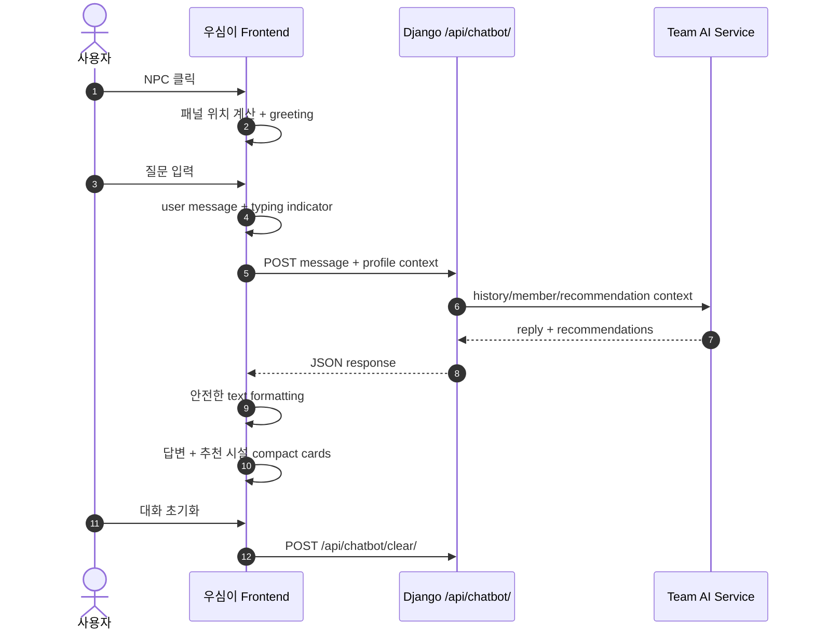

# AI Coach UI Flow

```mermaid
sequenceDiagram
    autonumber
    actor U as 사용자
    participant UI as 우심이 Frontend
    participant DJ as Django /api/chatbot/
    participant TEAM as Team AI Service

    U->>UI: NPC 클릭
    UI->>UI: 패널 위치 계산 + greeting
    U->>UI: 질문 입력
    UI->>UI: user message + typing indicator
    UI->>DJ: POST message + profile context
    DJ->>TEAM: history/member/recommendation context
    TEAM-->>DJ: reply + recommendations
    DJ-->>UI: JSON response
    UI->>UI: 안전한 text formatting
    UI->>UI: 답변 + 추천 시설 compact cards
    U->>UI: 대화 초기화
    UI->>DJ: POST /api/chatbot/clear/
```

## Frontend boundary

이 구조에서 개인 포트폴리오가 다루는 핵심은 **UI ↔ Django API 경계**입니다. OpenAI 호출 및 운동처방 데이터 검색은 Team implementation으로 구분합니다.
