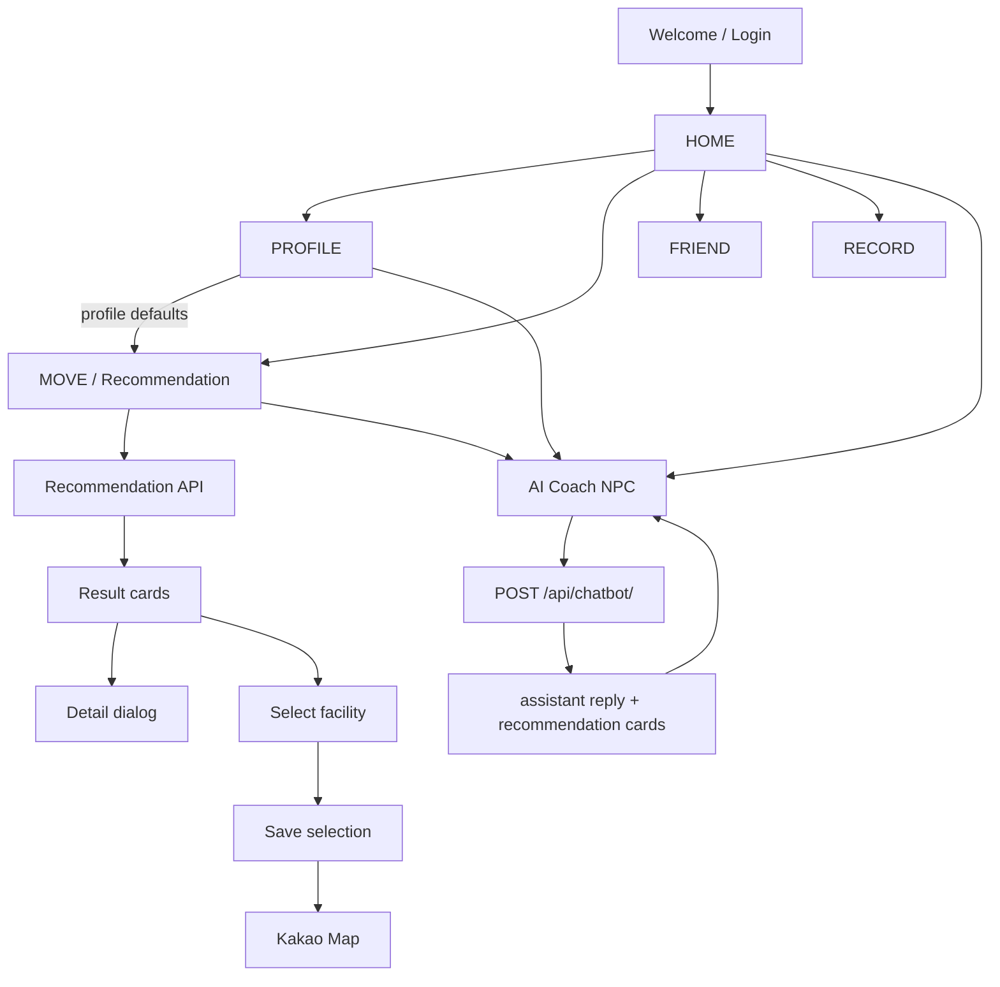

# Frontend Flow

## Frontend responsibilities

- 사용자 입력 수집과 validation
- API request 상태 표현
- 결과/오류/빈 상태 렌더링
- 서버의 추천 근거를 이해 가능한 정보 계층으로 변환
- session/profile context를 Django Template과 JS에서 이어 받기
- AI 코치 및 캐릭터 interaction
