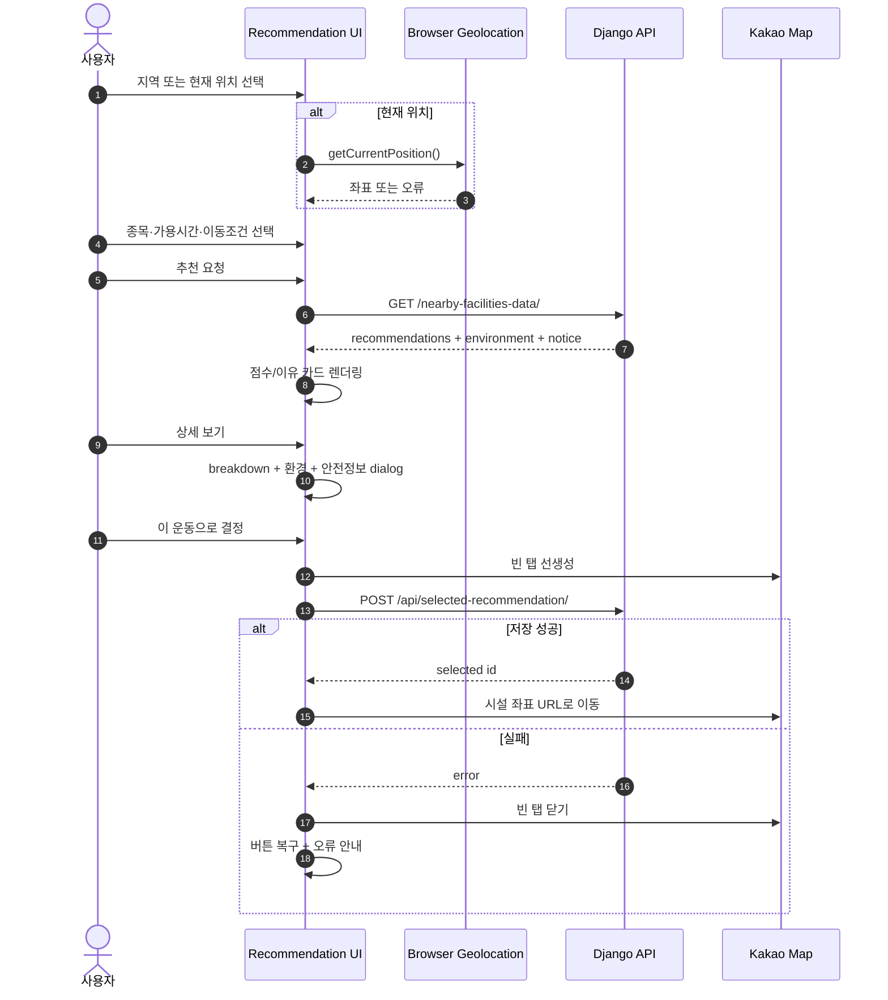

# Recommendation UI Flow

```mermaid
sequenceDiagram
    autonumber
    actor U as 사용자
    participant UI as Recommendation UI
    participant GEO as Browser Geolocation
    participant DJ as Django API
    participant MAP as Kakao Map

    U->>UI: 지역 또는 현재 위치 선택
    alt 현재 위치
        UI->>GEO: getCurrentPosition()
        GEO-->>UI: 좌표 또는 오류
    end
    U->>UI: 종목·가용시간·이동조건 선택
    U->>UI: 추천 요청
    UI->>DJ: GET /nearby-facilities-data/
    DJ-->>UI: recommendations + environment + notice
    UI->>UI: 점수/이유 카드 렌더링
    U->>UI: 상세 보기
    UI->>UI: breakdown + 환경 + 안전정보 dialog
    U->>UI: 이 운동으로 결정
    UI->>MAP: 빈 탭 선생성
    UI->>DJ: POST /api/selected-recommendation/
    alt 저장 성공
        DJ-->>UI: selected id
        UI->>MAP: 시설 좌표 URL로 이동
    else 실패
        DJ-->>UI: error
        UI->>MAP: 빈 탭 닫기
        UI->>UI: 버튼 복구 + 오류 안내
    end
```

## UX decisions

- GPS와 지역 입력의 기준이 섞이지 않도록 mode 분리
- 네트워크 실패와 결과 0건을 다르게 표현
- 점수보다 근거를 먼저 이해할 수 있는 정보 계층
- 비동기 저장 이후 popup 차단을 피하기 위한 새 탭 선생성
